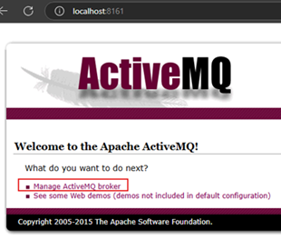
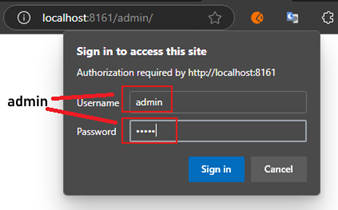
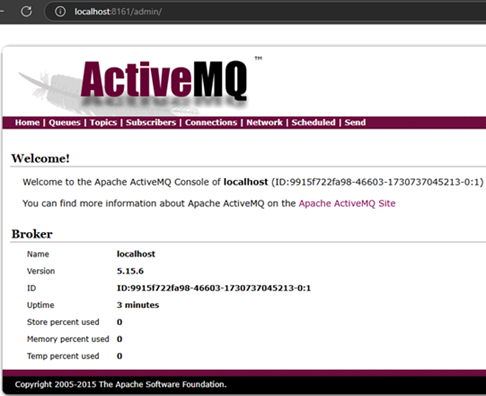
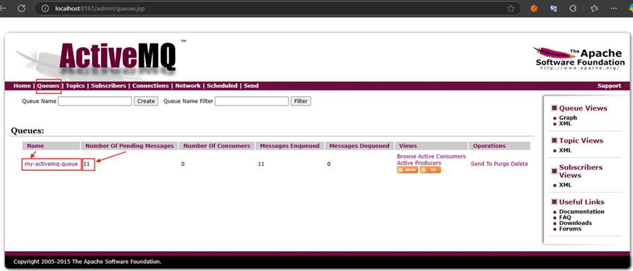
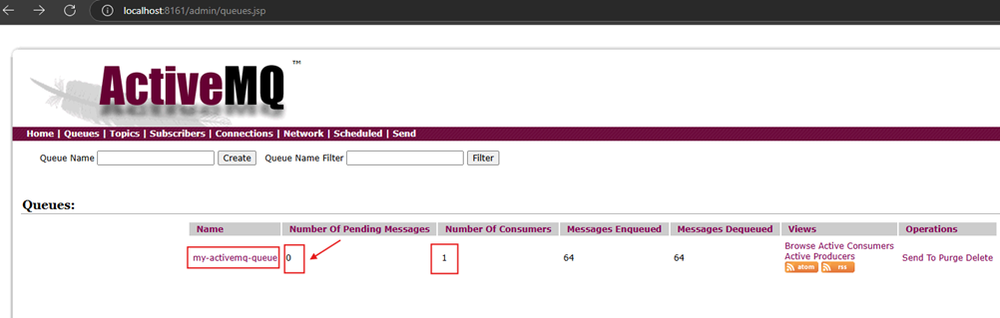
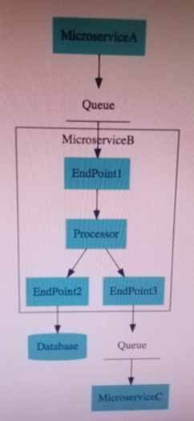
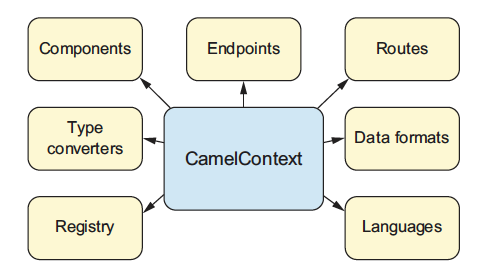

# Sección 02: Integrando Apache Camel con ActiveMQ y Kafka

---

## ¿Qué es Apache ActiveMQ?

`Apache ActiveMQ` es un broker de mensajes de código abierto que permite la comunicación asíncrona entre aplicaciones
o sistemas mediante el uso de mensajes. Es parte de la especificación `Java Message Service (JMS)`, por lo que es
compatible con aplicaciones basadas en JMS y otros protocolos de mensajería, como AMQP, MQTT, STOMP y WebSocket.

### Características principales de Apache ActiveMQ

1. `Mensajería asíncrona`: Permite el intercambio de mensajes sin la necesidad de que los sistemas estén directamente
   conectados o en tiempo real.
2. `Colas y temas (topics)`: `ActiveMQ` soporta tanto colas (donde cada mensaje se consume por un solo receptor) como
   temas (donde cada mensaje puede ser consumido por múltiples suscriptores).
3. `Persistencia de mensajes`: Ofrece almacenamiento persistente de mensajes, lo que permite la recuperación de mensajes
   en caso de fallos.
4. `Escalabilidad y distribución`: Puede configurarse en un clúster para balancear la carga y mejorar la disponibilidad.
5. `Compatibilidad con múltiples protocolos`: Admite varios protocolos de mensajería, lo que facilita su integración con
   diferentes sistemas y plataformas.

### Casos de uso

- `Microservicios`: Permite que los microservicios se comuniquen de forma asíncrona, mejorando la eficiencia y
  disponibilidad.
- `Integración de sistemas`: Ideal para conectar sistemas heterogéneos en una arquitectura orientada a eventos.
- `Procesamiento de eventos`: Facilita la implementación de patrones de diseño basados en eventos para procesar datos
  de forma eficiente.

`Apache ActiveMQ` es ampliamente utilizado en entornos empresariales donde se requiere una alta disponibilidad y
confiabilidad en el intercambio de mensajes.

## Crea contenedor de Apache ActiveMQ

Para continuar con nuestros ejemplos, en este apartado crearemos el contenedor de `Apache ActiveMQ` utilizando el
siguiente comando.

````bash
$ docker container run -d --name c-active-mq -p 61616:61616 -p 8161:8161 rmohr/activemq
````

Si listamos los contenedores veremos que nuestro contenedor de `ActiveMQ` se está ejecutando sin problemas.

````bash
$ docker container ls -a
CONTAINER ID   IMAGE                             COMMAND                  CREATED         STATUS                        PORTS                                                                                   NAMES
9915f722fa98   rmohr/activemq                    "/bin/sh -c 'bin/act…"   9 seconds ago   Up 9 seconds                  1883/tcp, 5672/tcp, 0.0.0.0:8161->8161/tcp, 61613-61614/tcp, 0.0.0.0:61616->61616/tcp   c-active-mq                                                                                            c-jenkins
````

Mediante el navegador vamos a la siguiente dirección `http://localhost:8161`.



Ingresamos las credenciales `admin` y `admin`.



Finalmente, vemos la pantalla principal luego de haber iniciado sesión exitosamente.



## Creación de una ruta de Camel remitente para ActiveMQ en el camel-microservice-a

Como vamos a comunicarnos con `Apache ActiveMQ`, necesitamos agregar en el `pom.xml` del microservicio
`camel-microservice-a` la dependencia de `Apache Camel para ActiveMQ`.

````xml

<dependency>
    <groupId>org.apache.camel.springboot</groupId>
    <artifactId>camel-activemq-starter</artifactId>
    <version>4.8.1</version>
</dependency>
````

En seguida, agregamos la siguiente configuración en el `application.yml`. Recordemos que el puerto `61616` es el
puerto que definimos al crear el contenedor de `Apache ActiveMQ`.

````yml
spring:
  activemq:
    broker-url: tcp://localhost:61616
````

Finalmente, crearemos una clase llamada `ActiveMqSenderRoute` donde crearemos como fuente un temporizador que estará
enviando en intervalos regulares de 10 segundos un mensaje a la cola.

````java

@Component
public class ActiveMqSenderRoute extends RouteBuilder {
    @Override
    public void configure() throws Exception {
        from("timer:active-mq-timer?period=10000")
                .transform().constant("Mi mensaje para Active MQ")
                .log("${body}")
                .to("activemq:my-activemq-queue");
    }
}
````

Dentro del método `configure()`:

- `from("timer:active-mq-timer?period=10000")`: Configura una fuente de mensajes usando un temporizador. Este
  temporizador se activa cada 10 segundos (10000 milisegundos).
- `.transform().constant("Mi mensaje para Active MQ")`: Transforma cada mensaje generado por el temporizador en la
  cadena constante `"Mi mensaje para Active MQ"`.
- `.log("${body}")`: Registra el contenido del mensaje en los logs. La expresión `${body}` se usa para acceder al cuerpo
  del mensaje actual.
- `.to("activemq:my-activemq-queue")`: Envía el mensaje transformado a una cola de `ActiveMQ` llamada
  `my-activemq-queue`.

En resumen, esta ruta en `Camel` se activa cada 10 segundos, genera un mensaje constante, lo registra y luego lo envía a
una cola en `ActiveMQ`.

Al ejecutar la aplicación veremos en consola que cada 10 segundos se está enviando a la cola el siguiente mensaje.

````bash
[camel-microservice-a] [active-mq-timer] route1                                   : Mi mensaje para Active MQ
````

Si observamos en la web la cola del `ActiveMQ`, veremos que los mensajes se están acumulando cada 10 segundos. En la
imagen observamos la cola `my-activemq-queue` que al momento de capturar la imagen tiene `11` mensajes en cola.



## Creación de una ruta de Camel receptor para ActiveMQ en el camel-microservice-b

Recordemos que en el apartado anterior creamos en el microservicio `camel-microservice-a` una clase llamada
`ActiveMqSenderRoute` donde configuramos la ruta para poder enviar información a la cola de `ActiveMQ`.

En este apartado, trabajaremos con el microservicio `camel-microservice-b`, donde crearemos una clase llamada
`ActiveMqReceiverRoute` que nos permitirá procesar la información que obtenga de la cola de `ActiveMQ`.

Empezaremos agregando la dependencia de `Camel` con la integración de `ActiveMQ` en nuestro microservicio
`camel-microservice-b`.

````xml

<dependency>
    <groupId>org.apache.camel.springboot</groupId>
    <artifactId>camel-activemq-starter</artifactId>
    <version>4.8.1</version>
</dependency>
````

También agregaremos las siguientes configuraciones en el `application.yml`.

````yml
server:
  port: 8000
  error:
    include-message: always

spring:
  application:
    name: camel-microservice-b

  activemq:
    broker-url: tcp://localhost:61616
````

Ahora procedemos a crear la clase `ActiveMqReceiverRoute` donde configuraremos una ruta de camel para poder consumir la
información desde `ActiveMQ`.

````java

@Component
public class ActiveMqReceiverRoute extends RouteBuilder {
    @Override
    public void configure() throws Exception {
        from("activemq:my-activemq-queue")
                .to("log:received-message-from-active-mq");
    }
}
````

Recordemos que en el microservicio `camel-microservice-a` estamos enviando información a la cola de `ActiveMQ` de esta
manera `.to("activemq:my-activemq-queue")`, por lo que, ahora en este microservicio `camel-microservice-b` necesitamos
consumir dicha cola `(my-activemq-queue)`, así que eso es lo que pondremos en el `from()`. Ahora, la información que
consumamos simplemente lo vamos a imprimir en consola.

Si ejecutamos la aplicación veremos en consola, en primer lugar la cantidad de mensajes acumulados en la cola del
`ActiveMQ`, eso es porque en el apartado anterior habíamos trabajado con el microservicio que enviaba mensajes a la
cola y no había quién lo consuma. Entonces, ahora nuestra aplicación `camel-microservice-b` está consumiéndolos, luego
cada 10 segundos irá consumiendo lo que se publique en la cola del `ActiveMQ`.

````bash
[camel-microservice-b] [activemq-queue]] received-message-from-active-mq          : Exchange[ExchangePattern: InOnly, BodyType: String, Body: Mi mensaje para Active MQ]
[camel-microservice-b] [activemq-queue]] received-message-from-active-mq          : Exchange[ExchangePattern: InOnly, BodyType: String, Body: Mi mensaje para Active MQ]
[camel-microservice-b] [activemq-queue]] received-message-from-active-mq          : Exchange[ExchangePattern: InOnly, BodyType: String, Body: Mi mensaje para Active MQ]
[camel-microservice-b] [activemq-queue]] received-message-from-active-mq          : Exchange[ExchangePattern: InOnly, BodyType: String, Body: Mi mensaje para Active MQ]
[camel-microservice-b] [activemq-queue]] received-message-from-active-mq          : Exchange[ExchangePattern: InOnly, BodyType: String, Body: Mi mensaje para Active MQ]
[camel-microservice-b] [activemq-queue]] received-message-from-active-mq          : Exchange[ExchangePattern: InOnly, BodyType: String, Body: Mi mensaje para Active MQ]
...
````

Ahora, si entramos en la web del `ActiveMQ` y revisamos nuestra cola `my-activemq-queue` veremos que no tendremos
mensajes pendientes, ya que nuestro consumidor está trabajando correctamente.



## Comprendiendo la terminología y arquitectura de Camel

- `Camel Context`: (0..n) Routes + Components + ...
    - `Endpoint`, reference to a queue, database or a file
    - `Route`, endpoints + processor(s) + transformer(s)
    - `Components`, extensions (Kafka, JSON, JMS, etc)
    - `Transformation`:
        - Data format transformation - XML to JSON
        - Data type transformation - String to CurrencyConversionBean
- `Message`, Body + Headers + Attachments
- `Exchange`, Request + Response
    - Exchange ID
    - Message Exchange Pattern (MEP) - InOnly/InOut
    - Input Message and (Optional) Output Message



`CamelContext` es el sistema de ejecución que reúne todos los conceptos fundamentales de `Apache Camel` (rutas, puntos
finales, componentes, etc.).

Este objeto de contexto representa el sistema de ejecución de Camel. Normalmente, hay una instancia de `CamelContext`
en una aplicación.



`CamelContext` proporciona acceso a muchas funciones y servicios, entre los que destacan componentes, conversores de
tipos, un registro, puntos finales, rutas, formatos de datos e idiomas.

En `Apache Camel`, el `Camel Context` es el corazón de cualquier aplicación `Camel`, especialmente cuando se usa en
conjunto con Spring Boot. El `Camel Context` actúa como el entorno donde se configuran y gestionan todas las rutas,
componentes, endpoints y otras configuraciones necesarias para el flujo de integración.

### ¿Qué es el Camel Context?

El `Camel Context` es como un contenedor o motor central que maneja y ejecuta las rutas de Camel, donde define la lógica
y el flujo de los datos que pasan por la aplicación. En términos simples, es donde "vive" la configuración de Camel, y
es responsable de las siguientes funciones clave:

1. `Gestión de rutas`: El `Camel Context` administra las rutas, que son secuencias de instrucciones que determinan cómo
   los mensajes fluyen a través de los endpoints.
2. `Instanciación y gestión de componentes`: Cada componente (como File, JMS, FTP, SFTP, etc.) se registra en el Camel
   Context. Esto permite que las rutas accedan a estos componentes mediante URIs específicos.
3. `Gestión de endpoints`: Un `endpoint` es un punto de `entrada` o `salida` para el flujo de datos en una ruta de
   Camel. El Camel Context se asegura de que los endpoints se gestionen adecuadamente.
4. `Intercepción y monitoreo de mensajes`: Proporciona una capa donde puedes agregar interceptores para monitorear o
   modificar mensajes en el flujo.

### Componentes del Camel Context

Algunos de los elementos más importantes que maneja el `Camel Context` incluyen:

- `Endpoints`: Son puntos de comunicación en Camel. Un endpoint puede ser cualquier cosa que envíe o reciba mensajes,
  como un archivo, una cola de mensajes, un servicio HTTP, etc. Cada endpoint se define usando un URI específico del
  componente (por ejemplo, `file:input` o `jms:queue:myQueue`).


- `Routes`: Las rutas (routes) son secuencias de instrucciones en Camel que definen el flujo de un mensaje. Cada ruta
  comienza con un endpoint de origen y luego pasa por varios pasos, como transformaciones, filtros y otras lógicas de
  procesamiento, hasta llegar a un endpoint de destino.


- `Componentes`: Son "conectores" reutilizables que permiten que Camel se conecte a diferentes sistemas, protocolos o
  tecnologías, como bases de datos, FTP, APIs REST, etc. Los componentes definen los tipos de endpoints que puedes usar
  y se cargan en el Camel Context automáticamente al iniciar la aplicación.

## Desagrupación de mensajes JSON en Java Bean en Camel Route de ActiveMQ

En los apartados anteriores habíamos creado en nuestros microservicios uno que envíaba mensaje a la cola de `ActiveMQ`
y el otro microservicio era quien lo consumía. En este apartado, enviaremos como mensaje a la cola de `ActiveMQ` un
archivo `JSON` y será el otro microservicio quien consuma ese JSON y lo convierta a un objeto java.

En el microservicio `camel-microservice-a`, al colocar un archivo `.json` en el directorio `/json` automáticamente se
envía a la cola `my-activemq-queue` del `ActiveMQ` y el archivo se guarda dentro del `/json/.camel`. Luego, como tenemos
definido el `.log("${body}") en la ruta de camel, vemos que se muestra en el log el contenido enviado.

### En el camel-microservice-a

Empezaremos creando un directorio en la raíz de este proyecto `/files/json`. En este directorio colocaremos el archivo
`.json` que enviaremos a la cola de `ActiveMQ`.

````bash
/files/json
````

Ahora, modificamos la clase `ActiveMqSenderRoute` para poder enviar archivos json a la cola `my-activemq-queue` del
`ActiveMQ`.

````java

@Component
public class ActiveMqSenderRoute extends RouteBuilder {
    @Override
    public void configure() throws Exception {
        from("file:files/json")
                .log("${body}")
                .to("activemq:my-activemq-queue");
    }
}
````

Notar que como origen o fuente de datos estamos definiendo la ruta que creamos anteriormente `files/json` y como
destino, estamos definiendo la cola `my-activemq-queue` del `ActiveMQ`.

Cuando coloquemos algún archivo `.json` en el directorio `files/json` veremos en consola de este microservicio el
siguiente resultado, esto es gracias al `.log("${body}")`.

````bash
[camel-microservice-a] [le://files/json] route1                                   : {
  "id": 1000,
  "from": "USD",
  "to": "INR",
  "conversionMultiple": 70
}
````

### En el camel-microservice-b

Iniciamos agregando la dependencia de Jackson integrada a Camel ya que lo usaremos para convertir un objeto json a su
correspondiente objeto java.

````xml

<dependency>
    <groupId>org.apache.camel.springboot</groupId>
    <artifactId>camel-jackson-starter</artifactId>
    <version>4.8.1</version>
</dependency>
````

A continuación, vamos a crear una clase de modelo llamado `CurrencyExchange`. Esta clase es una especie dto o pojo que
contiene los atributos idénticos del json que se recepcionará.

````java

@ToString
@AllArgsConstructor
@NoArgsConstructor
@Builder
@Getter
@Setter
public class CurrencyExchange {
    private Long id;
    private String from;
    private String to;
    private BigDecimal conversionMultiple;
}
````

Realizamos algunas modificaciones a la clase `ActiveMqReceiverRoute` donde vamos a hacer la conversión `(unmarshal)`
del `json` obtenido de la cola `my-activemq-queue` a un objeto java que será del tipo `CurrencyExchange`.

````java

@Component
public class ActiveMqReceiverRoute extends RouteBuilder {

    @Override
    public void configure() throws Exception {
        from("activemq:my-activemq-queue")
                .unmarshal().json(JsonLibrary.Jackson, CurrencyExchange.class)
                .to("log:received-message-from-active-mq");
    }
}
````

Luego de ejecutar la aplicación vemos el siguiente log mostrado en consola, donde vemos que efectivamente se está
realizando la conversión del json consumido al tipo `BodyType: dev.magadiflo.app.models.CurrencyExchange`.

````bash
[camel-microservice-b] [activemq-queue]] received-message-from-active-mq          : Exchange[ExchangePattern: InOnly, BodyType: dev.magadiflo.app.models.CurrencyExchange, Body: CurrencyExchange(id=1000, from=USD, to=INR, conversionMultiple=70)]
````
